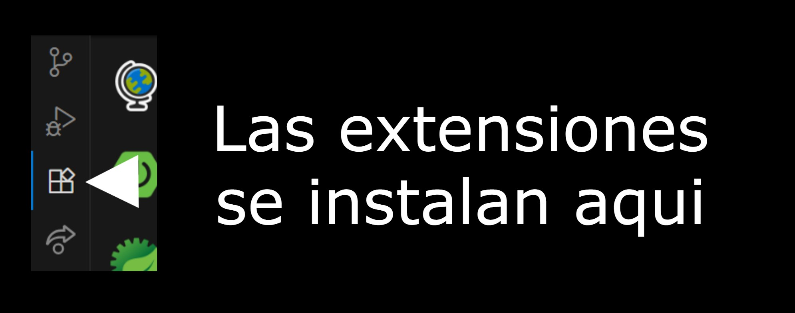

# 🏦 Aplication_Bank
Este proyecto fue creado en **Java** usando **Spring Boot** y **Maven**.  
Su objetivo es poder hacer las operaciones que un banco hace normalmente,por ejemplo (Transacciones, Retiros, Depositos, etc).  

## 📄 Características
- Hecho con Spring Boot + Java
- API REST con endpoints documentados
- probado con Thunder Client  

## 📤 Aplicaciones Principales (Obligatorias)
‣ 🟦 **Visual Studio Code** | Esta es la App que permite editar todo el codigo, ejecutarlo y instalar las extensiones. | [Descargar](https://vscode.download.prss.microsoft.com/dbazure/download/stable/7d842fb85a0275a4a8e4d7e040d2625abbf7f084/VSCodeUserSetup-x64-1.105.1.exe)  
‣ 🟫 **Java SE Development Kit (JDK)** | Es el paquete que contiene todo lo necesario para desarrollar y ejecutar programas java. | [Descargar](https://download.oracle.com/java/25/latest/jdk-25_windows-x64_bin.exe)

## 📦 Extensiones Usadas
▪ ☕ **Extension Pack for Java** | Incluye todo lo necesario para trabajar con proyectos Java (Debug, Maven, etc). | [Descargar](https://marketplace.visualstudio.com/items?itemName=vscjava.vscode-java-pack)  
▪ 🐞 **Debugger for Java** | Depurador oficial de Microsoft para proyectos Java. | [Descargar](https://marketplace.visualstudio.com/items?itemName=vscjava.vscode-java-debug)  
▪ 💜 **Maven for Java** | Permite manejar dependencias y construir proyectos con Maven. | [Descargar](https://marketplace.visualstudio.com/items?itemName=vscjava.vscode-maven)  
▪ ⚙️ **Project Manager for Java** | Gestión de proyectos Java dentro de VS Code. | [Descargar](https://marketplace.visualstudio.com/items?itemName=vscjava.vscode-java-dependency)  
▪ 💚 **Spring Boot Extension Pack** | Extensiones esenciales para desarrollar con Spring Boot. | [Descargar](https://marketplace.visualstudio.com/items?itemName=pivotal.vscode-boot-dev-pack)  
▪ 🚀 **Spring Boot Dashboard** | Permite correr, detener y monitorear proyectos Spring Boot fácilmente. | [Descargar](https://marketplace.visualstudio.com/items?itemName=vscjava.vscode-spring-boot-dashboard)  
▪ ⚡ **Thunder Client** | Cliente REST para probar APIs directamente en VS Code. | [Descargar](https://marketplace.visualstudio.com/items?itemName=rangav.vscode-thunder-client)  

## 😎 Pasos para abrir y ejecutar el codigo correctamente
## |Paso 1️⃣|  
› Lo principal es descargar JDK y Visual Studio Code desde la seccion de (📤 Aplicaciones Principales)  

## |Paso 2️⃣|  
› Abrir Visual Studio code

## |Paso 3️⃣|  
› Descargar las extensiones

