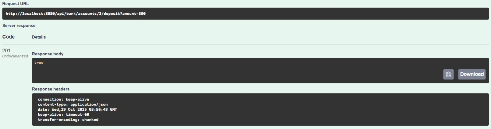
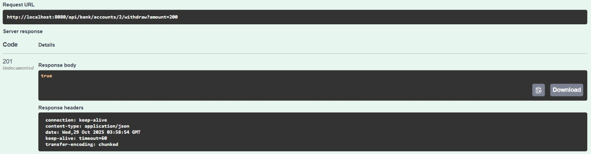
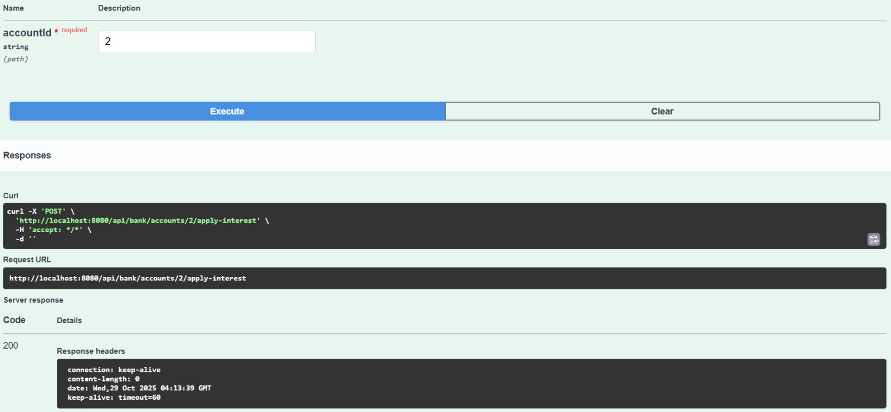

# 🏦 Aplication_Bank
Este proyecto fue creado en **Java** usando **Spring Boot** y **Maven**.  
Su objetivo es poder hacer las operaciones que un banco hace normalmente,por ejemplo (Transacciones, Retiros, Depositos, etc).  

## 📄 Características
- Hecho con **Spring Boot + Java**
- API REST con endpoints documentados
- Se uso Springdoc OpenAPI para una documentacion automatica
- probado con Thunder Client

## 💾 Arquitectura usada
⁍ **Controller: ** Es el encargado de los endpoints  
⁍ **Service: ** Contiene la logica del banco  
⁍ **Repository: ** Gestiona el almacenamiento y lectura de datos en archivos JSON  
⁍ **Model: ** Define las entidades principales del sistema  
⁍ **Exception: ** Maneja las excepciones personalizadas del dominio  

## 📤 Aplicaciones Principales (Obligatorias)
‣ 🟦 **Visual Studio Code** | Esta es la App que permite editar todo el codigo, ejecutarlo y instalar las extensiones. | [Descargar](https://vscode.download.prss.microsoft.com/dbazure/download/stable/7d842fb85a0275a4a8e4d7e040d2625abbf7f084/VSCodeUserSetup-x64-1.105.1.exe)  
‣ 🟫 **Java SE Development Kit (JDK)** | Es el paquete que contiene todo lo necesario para desarrollar y ejecutar programas java. | [Descargar](https://download.oracle.com/java/25/latest/jdk-25_windows-x64_bin.exe)


## 📦 Extensiones Usadas
▪ ☕ **Extension Pack for Java** | Incluye todo lo necesario para trabajar con proyectos Java (Debug, Maven, etc). | [Descargar](https://marketplace.visualstudio.com/items?itemName=vscjava.vscode-java-pack)  
▪ 🐞 **Debugger for Java** | Depurador oficial de Microsoft para proyectos Java. | [Descargar](https://marketplace.visualstudio.com/items?itemName=vscjava.vscode-java-debug)  
▪ 💜 **Maven for Java** | Permite manejar dependencias y construir proyectos con Maven. | [Descargar](https://marketplace.visualstudio.com/items?itemName=vscjava.vscode-maven)  
▪ ⚙️ **Project Manager for Java** | Gestión de proyectos Java dentro de VS Code. | [Descargar](https://marketplace.visualstudio.com/items?itemName=vscjava.vscode-java-dependency)  
▪ 💚 **Spring Boot Extension Pack** | Extensiones esenciales para desarrollar con Spring Boot. | [Descargar](https://marketplace.visualstudio.com/items?itemName=pivotal.vscode-boot-dev-pack)  
▪ 🚀 **Spring Boot Dashboard** | Permite correr, detener y monitorear proyectos Spring Boot fácilmente. | [Descargar](https://marketplace.visualstudio.com/items?itemName=vscjava.vscode-spring-boot-dashboard)  
▪ ⚡ **Thunder Client** | Cliente REST para probar APIs directamente en VS Code. | [Descargar](https://marketplace.visualstudio.com/items?itemName=rangav.vscode-thunder-client)  

## 😎 Pasos para abrir y ejecutar el codigo correctamente
## |Paso 1️⃣|  
› Lo principal es descargar **JDK** y **Visual Studio Code** desde la seccion de (📤 Aplicaciones Principales)  

## |Paso 2️⃣|  
› Abrir **Visual Studio code**.

## |Paso 3️⃣|  
› Descargar las extensiones.  

  

## |Paso 4️⃣|  
› Abrir el proyecto (Se tiene que descargar previamente, desde la parte de "<> code" y "Download Zip", luego se extrae en una carpeta) para abrirla se hace:  

  

## |Paso 5️⃣|  
› Para correr el proyecto desde **Spring Boot**, se necesitan las extensiones que se ubican en (📦 Extensiones Usadas), luego irse al icono de Spring y hacer esto:  

  

## |Paso 6️⃣|  
› Para probar que el proyecto funciona necesitamos thunder, que es una de las extensiones que se necesitan descargar.  
Tenemos que crear el "New request"  

  

## |Paso 7️⃣|  
› Luego de crear el **Thunder**, necesitamos seguir estos 5 pasos para que funcione de manera correcta.  
1. Colocar de manera correcta la **URL** en la mayoria de casos usa el puerto 8080 ( http://localhost:8080/api/bank/customers )
2. Verificar que el endpoint, sea el correcto, para saber cual usar se puede verificar desde el apartado de controlador.
3. Irse a la parte de body para copiar el codigo correspondiente.  
4. Colocar el codigo **JSON**, en este caso seria este:  

{
  "id": "1" ,
  "name": "Juan" ,
  "email": "juancarlossalazar@gmail.com"
}

5. Le dariamos click al boton de "Send" para enviarlo y que se muestre el usuario ya creado.

  

## |Paso 8️⃣|  
› Para verificar que el thunder envio el codigo **JSON** al servidor local, se coloca el mismo URL que usamos en este caso es  
( http://localhost:8080/api/bank/customers ) esta **URL** se coloca en un navegador y deberia salir asi:  

  

## Otros Metodos  
## 👥| Buscar todos los usuarios  
• En el **URL** debe ir asi: http://localhost:8080/api/bank/customers  
• Metodo: **GET**  

## 🔍| Buscar Cuenta de un Cliente por ID  
• En el **URL** debe ir asi: http://localhost:8080/api/bank/customers/{id_cliente}/accounts  
• Metodo: **GET**  
• En la parte {id_cliente}, seria colocar el ID correspondiente de un cliente ya creado  

## 💰| Crear Cuenta (Corriente)  
• En el **URL** debe ir asi: http://localhost:8080/api/bank/customers/{id_cliente}/accounts  
• Metodo: **POST**  
• Archivo JSON:  
{
  "type": "CHECKING" ,
  "accountId": "1" ,
  "parameter": 300.0
}  

## 🔑| Crear Cuenta (Ahorros)  
• En el **URL** debe ir asi: http://localhost:8080/api/bank/customers/{id_cliente}/accounts  
• Metodo: **POST**  
• Archivo JSON:  
{
  "type": "SAVINGS" ,
  "accountId": "1" ,
  "parameter": 0.05
}  

## 🔎| Buscar Cuenta por ID  
• En el **URL** debe ir asi: http://localhost:8080/api/bank/accounts/{id_cuenta}  
• Metodo: **GET**  
• En la parte {id_cuenta}, seria colocar un ID correspondiente  

## 📥| Realizar deposito  
• En el **URL** debe ir asi: http://localhost:8080/api/bank/accounts/{id_cuenta}/deposit?amount={monto}    
• Metodo: **POST**  
• En la parte {id_cuenta}, seria colocar un ID correspondiente  
• En el {monto}, se coloca el precio a ingresar  

## 📤| Realizar retiro  
• En el **URL** debe ir asi: http://localhost:8080/api/bank/accounts/{id_cuenta}/withdraw?amount={monto}    
• Metodo: **POST**  
• En la parte {id_cuenta}, seria colocar un ID correspondiente  
• En el {monto}, se coloca el precio a retirar  

## 💸| Realizar transferencia 
• En el **URL** debe ir asi: http://localhost:8080/api/bank/accounts/{id_cuenta}/transfer      
• Metodo: **POST**  
• En la parte {id_cuenta}, seria colocar un ID correspondiente  
• Archivo JSON:  
{
  "toAccountId": "1" ,
  "amount": 150
}  

## 💻| Consultar Transacciones de una cuenta  
• En el **URL** debe ir asi: http://localhost:8080/api/bank/accounts/{id_cuenta}/transactions      
• Metodo: **GET**  
• En la parte {id_cuenta}, seria colocar un ID correspondiente  

## 🧾| Aplicar Intereses a una cuenta de ahorros  
• En el **URL** debe ir asi: http://localhost:8080/api/bank/accounts/{id_cuenta}/apply-interest      
• Metodo: **POST**  
• En la parte {id_cuenta}, seria colocar un ID correspondiente  

# Usando Swagger UI  
En esta parte se explicara como usar el Swagger UI de **OpenAPI** para generar la documentacion automatica.  

## 🔗 Endpoints principales:  
Swagger UI (URL): http://localhost:8080/swagger-ui.html  
Documentación JSON: http://localhost:8080/v3/api-docs  

## ⚙ Información de configuracion (Swagger UI):
Archivo: <kbd> com.logsoluprobl.appbank.config / OpenApiConfig.java </kbd>  

## Codigo  

```java
.title("Mi app de banco")  
.description("Esta es la descripción del proyecto")  
.version("1.0.0")  
.contact(new Contact()  
.name("Daniel Garcia")  
.email("correo@ejemplo.com")  
.url("https://url.de.proyecto.com"))  
```  

## Prueba con Swagger  

## 1️⃣| **Crear Cliente**  
⩺ Endpoint: <kbd>/api/bank/customers</kbd>  
⩺ Metodo: **POST**  

   

## 1️⃣.1️⃣| **Lista todos los clientes**  
⩺ Endpoint: <kbd>/api/bank/customers</kbd>  
⩺ Metodo: **GET**  

   

## 2️⃣| **Buscar Cliente Por ID**  
⩺ Endpoint: <kbd>/api/bank/customers/{customerId}</kbd>  
⩺ {customerId}: Colocar id valido de un usuario previamente creado    
⩺ Metodo: **GET**  

   

## 3️⃣| **Crear Cuenta Ahorros o Corriente**  
**Para  Crear la cuenta es necesario especificar si es (SAVINGS o CHECKING) en la parte de type**
⩺ Endpoint: <kbd>/api/bank/customers/{customerId}/accounts</kbd>  
⩺ {customerId}: Colocar id valido de un usuario previamente creado   
⩺ Metodo: **POST**  

   

## 4️⃣| **Listar las cuentas de un cliente**  
⩺ Endpoint: <kbd>/api/bank/customers/{customerId}/accounts</kbd>  
⩺ {customerId}: Colocar id valido de un usuario previamente creado   
⩺ Metodo: **GET**  

   

## 5️⃣| **Consultar Cuenta especifica**  
⩺ Endpoint: <kbd>/api/bank/accounts/{accountId}</kbd>  
⩺ {accountId}: Colocar id valido de una cuenta creada  
⩺ Metodo: **GET**  

   

## 6️⃣| **Realizar deposito**  
⩺ Endpoint: <kbd>/api/bank/accounts/{accountId}/deposit?amount={valor}</kbd>  
⩺ {accountId}: Colocar id valido de una cuenta creada  
⩺ {valor}: Un monto a colocar
⩺ Metodo: **POST**  

  

## 7️⃣| **Realizar retiro**  
⩺ Endpoint: <kbd>/api/bank/accounts/{accountId}/withdraw?amount={valor}</kbd>  
⩺ {accountId}: Colocar id valido de una cuenta creada  
⩺ {valor}: Un monto a retirar  
⩺ Metodo: **POST**  

  

## 8️⃣| **Transferir dinero entre cuentas**  
⩺ Endpoint: <kbd>/api/bank/accounts/{fromAccountId}/transfer</kbd>  
⩺ {fromAccountId}: Colocar id valido de una cuenta creada  
⩺ Metodo: **POST**  

  

## 9️⃣| **Lista de transacciones de una cuenta**  
⩺ Endpoint: <kbd>/api/bank/accounts/{accountId}/transactions</kbd>  
⩺ {accountId}: Colocar id valido de una cuenta creada  
⩺ Metodo: **GET**  

  

## 🔟| **Aplicar intereses**  
⩺ Endpoint: <kbd>/api/bank/accounts/{accountId}/apply-interest</kbd>  
⩺ {accountId}: Colocar id valido de una cuenta creada  
⩺ Metodo: **POST**  

  

                        

## 🔑 CREDITOS 

» Este trabajo fue supervisado por **Daniel Felipe**, quien brindó apoyo constante para que todo funcionara correctamente.  
Agradezco su ayuda y dedicación durante el desarrollo del proyecto.

» Tambien una parte del "README" me base en el de https://github.com/DanielDev87/logica-solucion-problemas?tab=readme-ov-file , para tener una idea de como hacerlo de manera correcta, gracias.  
